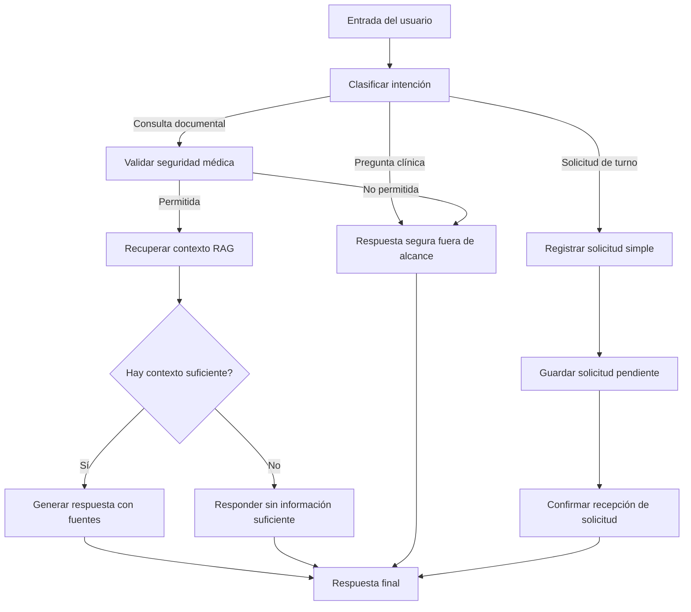
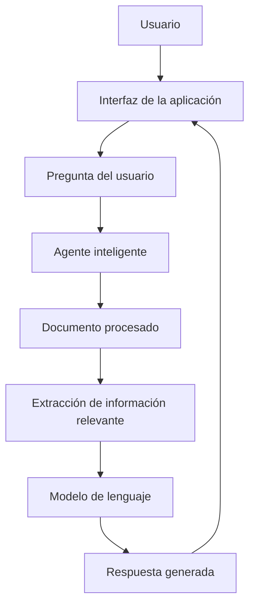
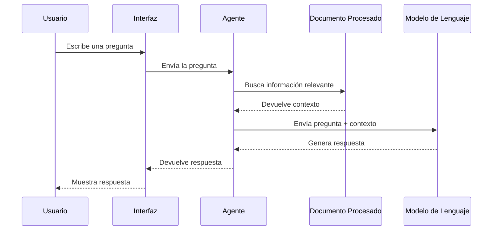
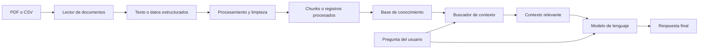

# PROMPT PARA CODEX: Planificación y Diagramado del Proyecto antes de Escribir Código

## Rol que debe asumir Codex

Actuá como un **desarrollador senior especializado en Python, IA aplicada a documentos, LangChain, arquitectura de software, documentación técnica y despliegue en Oracle Cloud Infrastructure (OCI)**.

Tu objetivo NO es empezar escribiendo código inmediatamente.

Primero debés **analizar, diseñar, documentar y diagramar el proceso completo del proyecto**.  
Solo después de tener una planificación clara, se podrá avanzar con la implementación.

---

# Proyecto: Agente Inteligente basado en Documentos PDF o CSV

## Descripción general

El proyecto consiste en construir una aplicación capaz de leer un documento en formato **PDF** o **CSV**, procesar su contenido y permitir que un usuario le haga preguntas a un agente de inteligencia artificial.

El agente debe responder usando la información contenida en el documento.

Finalmente, la aplicación debe desplegarse en la nube utilizando **Oracle Cloud Infrastructure (OCI)**.

---


# Contexto importante: no existen documentos previos

El usuario no cuenta actualmente con documentación existente para usar como fuente del agente.

Por lo tanto, el proyecto debe contemplar también la **creación de la documentación ficticia o simulada** que luego será usada por el agente inteligente.

Esto significa que antes de implementar el agente, Codex debe ayudar a definir y documentar:

- El tipo de empresa o contexto del proyecto.
- El problema que resolverá el agente.
- Los documentos fuente que se van a crear.
- El contenido mínimo de esos documentos.
- Las preguntas que el agente debería poder responder.
- Los datos o reglas internas que deberán estar escritos en los documentos.

La documentación generada debe ser realista, coherente y suficiente para que el agente tenga información útil sobre la cual responder.

---

# Decisión previa obligatoria: elegir el caso de uso

Como no hay documentación previa, Codex inicialmente debía preguntarle al usuario qué tipo de proyecto quería construir.

El usuario ya eligió el caso de uso de Clínica de Salud / Consultorio Médico.

Por lo tanto, Codex no debe volver a preguntar el caso de uso general. Debe avanzar con la planificación de este caso específico y preguntar únicamente las decisiones pendientes relevantes.

Opciones que fueron consideradas:

## Opción A: Compras, proveedores e inventario

Agente para consultar políticas internas de compras, recepción de mercadería, control de stock, aprobación de pagos y alta de proveedores.

Documentos posibles:

- `politica_compras.md`
- `manual_proveedores.md`
- `procedimiento_control_stock.md`
- `politica_aprobacion_pagos.md`
- `faq_operativa.md`

## Opción B: Recursos humanos y vacaciones

Agente para consultar políticas de vacaciones, licencias, ausencias, empleados activos, aprobaciones y beneficios.

Documentos posibles:

- `politica_vacaciones.md`
- `manual_empleado.md`
- `politica_licencias.md`
- `faq_rrhh.md`

## Opción C: Tienda online / e-commerce

Agente para consultar políticas de envíos, devoluciones, privacidad, términos y preguntas frecuentes de clientes.

Documentos posibles:

- `politica_envios.md`
- `politica_devoluciones.md`
- `politica_privacidad.md`
- `terminos_y_condiciones.md`
- `faq_clientes.md`

## Opción D: SaaS / plataforma digital

Agente para consultar documentación técnica y funcional de una plataforma digital.

Documentos posibles:

- `base_conocimiento_producto.md`
- `guia_uso_plataforma.md`
- `faq_soporte.md`
- `planes_y_precios.md`
- `terminos_uso.md`

## Opción E: Ventas con CSV

Agente para responder preguntas sobre datos de ventas usando un archivo CSV ficticio.

Documentos posibles:

- `ventas_ficticias.csv`
- `diccionario_datos.md`
- `reglas_negocio_ventas.md`

Codex debe recomendar una opción, pero no debe elegirla sin confirmación del usuario.

---

# Creación de documentos fuente

Una vez elegido el caso de uso, Codex debe crear una carpeta:

```text
source_documents/
```

Dentro de esa carpeta debe crear los documentos ficticios que servirán como fuente de información para el agente.

Ejemplo:

```text
source_documents/
├── politica_compras.md
├── manual_proveedores.md
├── procedimiento_control_stock.md
├── politica_aprobacion_pagos.md
└── faq_operativa.md
```

Estos documentos podrán luego convertirse a PDF si fuera necesario, pero durante la etapa inicial pueden mantenerse en Markdown para facilitar la edición.

---

# Requisitos de los documentos fuente

Cada documento fuente debe tener:

- Título claro.
- Contexto del documento.
- Reglas o procedimientos específicos.
- Secciones bien organizadas.
- Información suficiente para que el agente pueda responder preguntas.
- Ejemplos concretos.
- Fechas, plazos, roles o condiciones cuando corresponda.
- Lenguaje claro y profesional.

Los documentos no deben ser excesivamente largos, pero sí deben tener contenido suficiente para probar el agente.

---

# Documentación mínima recomendada para el caso de compras, proveedores e inventario

Si el usuario elige la opción de compras, proveedores e inventario, crear como mínimo:

## 1. `source_documents/politica_compras.md`

Debe incluir:

- Objetivo de la política.
- Roles involucrados.
- Solicitud de compra.
- Aprobaciones según monto.
- Compras urgentes.
- Compras recurrentes.
- Documentación requerida.
- Restricciones.

## 2. `source_documents/manual_proveedores.md`

Debe incluir:

- Alta de proveedores.
- Datos obligatorios del proveedor.
- Validaciones previas.
- Evaluación de proveedores.
- Baja o suspensión de proveedores.
- Condiciones de pago.

## 3. `source_documents/procedimiento_control_stock.md`

Debe incluir:

- Registro de ingreso de mercadería.
- Control físico contra sistema.
- Stock mínimo.
- Alertas de reposición.
- Diferencias de inventario.
- Inventarios periódicos.

## 4. `source_documents/politica_aprobacion_pagos.md`

Debe incluir:

- Requisitos para aprobar pagos.
- Validación de factura.
- Orden de compra.
- Remito o comprobante de recepción.
- Montos que requieren doble aprobación.
- Casos bloqueantes.

## 5. `source_documents/faq_operativa.md`

Debe incluir preguntas frecuentes como:

- ¿Qué hacer si falta stock?
- ¿Quién aprueba una compra urgente?
- ¿Qué pasa si la factura no coincide con la orden de compra?
- ¿Cómo se registra un nuevo proveedor?
- ¿Qué hacer si hay diferencia entre stock físico y sistema?

---

# Nueva etapa previa a la implementación

Antes de implementar el código del agente, agregar una etapa llamada:

## Fase -1: Definición del caso y creación de documentos fuente

Tareas:

- [ ] Preguntar al usuario qué caso de uso quiere elegir.
- [ ] Definir nombre ficticio de la empresa o sistema.
- [ ] Definir problema principal que resolverá el agente.
- [ ] Definir documentos fuente necesarios.
- [ ] Crear carpeta `source_documents/`.
- [ ] Crear documentos fuente ficticios.
- [ ] Revisar que los documentos tengan suficiente información.
- [ ] Definir preguntas de prueba basadas en esos documentos.
- [ ] Documentar esta decisión en `docs/08_riesgos_y_decisiones.md`.

Codex no debe avanzar a código hasta que esta fase esté completa.


# Caso de uso elegido por el usuario

El usuario eligió trabajar sobre el caso:

```text
Clínica de Salud / Consultorio Médico
```

El proyecto debe orientarse a construir un agente inteligente para una clínica o consultorio médico ficticio.

El agente debe responder preguntas basadas en documentación institucional creada para el proyecto, por ejemplo:

- Política de privacidad de datos del paciente.
- Preguntas frecuentes sobre consultas y turnos.
- Política de cancelaciones y reagendamiento.
- Guía de convenios y coberturas médicas.
- Instrucciones pre y post consulta.

---

# Nombre tentativo del proyecto

Codex debe proponer nombres posibles para el proyecto y preguntarle al usuario cuál prefiere antes de fijar uno definitivamente.

Nombres sugeridos:

- MediAssist Agent
- ClínicaBot IA
- SaludDocs Agent
- Consultorio Inteligente
- HealthCare Assistant
- Asistente IA para Clínica Médica

Codex no debe elegir el nombre definitivo sin confirmación del usuario.

---

# Alcance funcional del agente médico

El agente debe funcionar como un asistente de consulta documental para pacientes o personal administrativo.

Debe poder responder preguntas sobre:

- Cómo solicitar un turno.
- Cómo cancelar o reagendar una consulta.
- Qué documentación debe llevar el paciente.
- Qué convenios u obras sociales atiende la clínica ficticia.
- Qué datos personales se recopilan y cómo se protegen.
- Cuáles son los horarios de atención.
- Qué hacer antes de una consulta.
- Qué hacer después de una consulta.
- Qué reglas aplican para ausencias o llegadas tarde.
- Qué canales de contacto existen.
- Cómo funciona la atención de urgencias administrativas, si se define.

---


# Decisión recomendada sobre el modelo de IA

Para este proyecto, la recomendación es usar **Gemini API** como proveedor principal del modelo de lenguaje, dejando la arquitectura preparada para poder cambiar a OpenAI si fuera necesario.

## Recomendación principal

Usar:

```text
Gemini API
```

Con variables de entorno:

```text
GOOGLE_API_KEY
LLM_PROVIDER=gemini
LLM_MODEL=gemini-2.5-flash
EMBEDDINGS_PROVIDER=gemini
EMBEDDINGS_MODEL=gemini-embedding-2-preview
```

Codex debe confirmar el modelo exacto disponible antes de implementarlo, porque los nombres y disponibilidad de modelos pueden cambiar.

---

# Motivo de la elección

Gemini API es una buena opción para este challenge porque:

- Permite empezar con una capa gratuita para proyectos pequeños.
- La API key se puede obtener desde Google AI Studio.
- Tiene integración con LangChain mediante `langchain-google-genai`.
- Permite usar modelos de chat y embeddings dentro del mismo ecosistema.
- Es suficiente para una demo RAG con documentos ficticios.
- Reduce el riesgo de costos para una entrega académica.

---

# OpenAI como alternativa

OpenAI también es una muy buena opción técnica, especialmente por la calidad de sus modelos y su integración madura con LangChain.

Pero para este proyecto debe quedar como alternativa configurable.

Variables sugeridas:

```text
OPENAI_API_KEY
LLM_PROVIDER=openai
LLM_MODEL=gpt-5.4-mini
EMBEDDINGS_PROVIDER=openai
```

Codex no debe hardcodear el proveedor.

Debe crear una capa de configuración que permita elegir entre Gemini y OpenAI mediante variables de entorno.

---

# Regla de diseño obligatoria: proveedor intercambiable

El proyecto debe tener una abstracción para el modelo de IA.

No se debe escribir código acoplado directamente a un único proveedor.

Codex debe diseñar una función o módulo de configuración que permita seleccionar el proveedor.

Ejemplo conceptual:

```text
app/llm_provider.py
```

Responsabilidades:

- Leer `LLM_PROVIDER`.
- Inicializar Gemini si `LLM_PROVIDER=gemini`.
- Inicializar OpenAI si `LLM_PROVIDER=openai`.
- Leer el modelo desde variables de entorno.
- Evitar exponer claves API.
- Mostrar errores claros si falta una clave.

---

# Regla de seguridad sobre datos médicos

Este proyecto usa documentación y datos ficticios.

No se deben usar datos reales de pacientes.

Si en algún momento se usaran datos reales, Codex debe advertir que:

- No se deben subir datos sensibles a servicios externos sin revisión legal y de privacidad.
- No se debe usar una capa gratuita si el proveedor puede utilizar el contenido para mejorar productos.
- Se deben anonimizar o eliminar datos personales.
- Se deben revisar políticas de privacidad, cumplimiento normativo y seguridad.

Para el challenge, usar exclusivamente datos ficticios.

---

# Decisión que Codex debe preguntar

Antes de implementar el modelo, Codex debe preguntar:

```text
¿Qué proveedor de IA querés usar para el MVP?

Opción A: Gemini API. Recomendado para el challenge.
- Más conveniente para prototipo.
- Tiene capa gratuita para proyectos pequeños.
- Buena integración con LangChain.
- Permite usar embeddings del ecosistema Gemini.

Opción B: OpenAI API.
- Muy buena calidad de respuestas.
- Integración madura con LangChain.
- Requiere configurar API key y costos de uso.

Opción C: Dejar ambos configurables.
- Recomendado técnicamente.
- Usar Gemini por defecto.
- Permitir cambiar a OpenAI con variables de entorno.
```

Recomendación final para este proyecto:

```text
Elegir opción C, con Gemini como proveedor por defecto.
```

# Prioridad técnica central: RAG, LangChain, LangGraph y OCI

Aunque el proyecto tendrá un contexto de clínica médica ficticia y puede incluir una solicitud simple de turnos, NO se debe perder el enfoque original del Challenge.

El objetivo principal es demostrar conocimiento práctico en:

- RAG, Retrieval-Augmented Generation.
- LangChain.
- LangGraph.
- Procesamiento de documentos.
- Diseño de agentes con flujo controlado.
- Deploy en Oracle Cloud Infrastructure, OCI.
- Documentación técnica clara.

La funcionalidad de turnos debe ser un diferencial de producto, pero no debe reemplazar ni tapar el foco técnico del proyecto.

---

# Enfoque correcto del proyecto

El proyecto debe presentarse como:

```text
Un asistente inteligente basado en RAG para una clínica ficticia, construido con LangChain y LangGraph, capaz de responder consultas institucionales a partir de documentos, controlar preguntas fuera de alcance médico, registrar solicitudes simples de turnos y desplegarse en OCI.
```

No debe presentarse como un sistema tradicional de gestión médica.

---

# Qué debe demostrar técnicamente

Codex debe diseñar el proyecto para demostrar claramente:

## 1. Ingesta documental

- Carga de documentos fuente.
- Lectura de archivos Markdown, TXT o PDF.
- Normalización del contenido.
- Separación en chunks.
- Preparación de documentos para recuperación.

## 2. RAG

- Creación de una base consultable.
- Recuperación de fragmentos relevantes.
- Construcción de contexto para el modelo.
- Respuesta basada en documentos.
- Indicación de fuentes usadas.
- Manejo de casos sin contexto suficiente.

## 3. LangChain

Codex debe usar LangChain para las partes principales del flujo RAG, por ejemplo:

- Document loaders.
- Text splitters.
- Embeddings.
- Vector store o retriever.
- Prompt templates.
- Chain de pregunta-respuesta.
- Integración con el modelo de lenguaje.

## 4. LangGraph

Codex debe usar LangGraph para modelar el flujo del agente como grafo.

El grafo debe contemplar nodos como:

```text
recibir_pregunta
clasificar_intencion
validar_seguridad_medica
recuperar_contexto
generar_respuesta_rag
responder_fuera_de_alcance
registrar_solicitud_turno
mostrar_respuesta
```

El flujo debe poder decidir si la entrada del usuario es:

- Consulta documental.
- Pregunta médica fuera de alcance.
- Solicitud simple de turno.
- Consulta administrativa sobre turnos.
- Pregunta sin información suficiente.

## 5. Seguridad de dominio

El agente debe rechazar preguntas clínicas o médicas fuera de alcance.

Esto debe formar parte explícita del grafo de LangGraph, no ser solamente un texto en el prompt.

## 6. Deploy en OCI

La aplicación debe estar preparada para ejecutarse localmente y desplegarse en OCI.

El deploy debe estar documentado con:

- Pasos realizados.
- Requisitos.
- Variables de entorno.
- Comando de ejecución.
- Puerto utilizado.
- Evidencia del deploy.
- Link público o captura.

---

# Regla de alcance: turnos como feature secundaria

La funcionalidad de turnos debe mantenerse como una feature secundaria y controlada.

## Permitido en el MVP

- Formulario simple de solicitud de turno.
- Guardado de solicitudes en CSV o SQLite.
- Estado inicial `pendiente`.
- Panel administrativo básico para ver solicitudes.
- Uso de LangGraph para enrutar la intención de solicitud de turno.

## No permitido en el MVP

- Sistema médico completo.
- Calendario complejo.
- Historia clínica.
- Diagnóstico.
- Tratamientos.
- Login real.
- Integración con WhatsApp.
- Integración real con obras sociales.
- Integración obligatoria con Google Calendar.
- Confirmación automática de turnos reales.

---

# Nuevo documento técnico obligatorio

Codex debe crear también el documento:

```text
docs/11_diseno_rag_langgraph.md
```

Este documento debe explicar en detalle:

- Arquitectura RAG elegida.
- Flujo de LangChain.
- Grafo de LangGraph.
- Nodos del grafo.
- Condiciones de ruteo.
- Cómo se validan preguntas fuera de alcance médico.
- Cómo se recupera contexto.
- Cómo se generan respuestas.
- Cómo se registran solicitudes de turno sin mezclarlo con el flujo RAG.
- Qué decisiones quedan pendientes.

## Diagrama Mermaid esperado para LangGraph



---

# Criterio de éxito actualizado

El proyecto será considerado sólido si demuestra claramente:

- Documentos fuente bien creados.
- Pipeline RAG funcional.
- Uso explícito de LangChain.
- Uso explícito de LangGraph.
- Respuestas con fuentes.
- Control de preguntas médicas fuera de alcance.
- Solicitud simple de turnos como diferencial.
- Aplicación desplegada en OCI.
- README profesional.
- Diagramas técnicos claros.
- Casos de prueba reproducibles.

---

# Instrucción para Codex

Codex debe priorizar siempre el valor técnico del Challenge:

```text
Primero RAG + LangChain + LangGraph + OCI.
Después funcionalidades complementarias.
```

Si alguna funcionalidad extra complica o debilita el foco técnico, Codex debe proponer simplificarla y consultar al usuario.

# Estrategia para destacarse en el Challenge

Este proyecto forma parte del Challenge de Alura y el usuario quiere destacarse entre muchos alumnos.

Por lo tanto, el proyecto no debe limitarse a ser un chatbot simple que lee documentos. Debe presentarse como un **asistente administrativo inteligente para una clínica ficticia**, combinando:

1. Consulta documental con IA.
2. Respuestas basadas en documentos.
3. Reglas de seguridad para no dar diagnósticos médicos.
4. Solicitud simple de turnos.
5. Registro de solicitudes.
6. Panel administrativo básico.
7. Evidencia clara de deploy en OCI.
8. Documentación profesional.

La prioridad sigue siendo mantener un MVP posible de terminar, pero con suficiente diferencial para que se vea completo y serio.

---

# MVP diferencial recomendado

El MVP recomendado debe tener estas capacidades:

## 1. Agente documental

El usuario puede hacer preguntas sobre:

- Privacidad de datos del paciente.
- Consultas y turnos.
- Cancelaciones.
- Reagendamientos.
- Convenios y coberturas.
- Instrucciones pre y post consulta.

El agente responde usando los documentos de `source_documents/`.

## 2. Respuestas con fuente

Siempre que sea posible, el agente debe indicar de qué documento salió la información.

Ejemplo:

```text
Según el documento faq_consultas_turnos.md, para solicitar un turno el paciente puede comunicarse por WhatsApp, teléfono o formulario web.
```

Esto ayuda a demostrar que el agente no inventa respuestas.

## 3. Detección de preguntas fuera de alcance médico

El agente debe detectar preguntas clínicas o de diagnóstico.

Ejemplos:

```text
¿Qué medicamento debo tomar?
¿Tengo una infección?
¿Qué tratamiento necesito?
```

Resultado esperado:

```text
No puedo brindar diagnósticos ni indicaciones médicas personalizadas. Te recomiendo consultar con un profesional de salud o comunicarte con la clínica.
```

## 4. Solicitud simple de turno

El sistema debe permitir que un usuario solicite un turno completando datos básicos.

Campos sugeridos:

- Nombre y apellido.
- DNI o identificador ficticio.
- Email o teléfono.
- Especialidad.
- Profesional preferido, opcional.
- Fecha preferida.
- Franja horaria preferida.
- Motivo breve de consulta, sin pedir datos médicos sensibles innecesarios.

Importante:

- El sistema NO debe confirmar automáticamente un turno real.
- El sistema debe registrar una solicitud pendiente.
- El estado inicial debe ser `pendiente`.

## 5. Registro de solicitudes

Las solicitudes pueden guardarse inicialmente en:

```text
data/turnos_solicitudes.csv
```

O, si Codex lo considera más prolijo y el usuario confirma, en:

```text
SQLite
```

Para el MVP se recomienda empezar con CSV para reducir complejidad.

Campos sugeridos del CSV:

```text
id_solicitud,nombre,dni,email_telefono,especialidad,profesional_preferido,fecha_preferida,franja_horaria,motivo,estado,fecha_creacion
```

Estados posibles:

```text
pendiente
confirmado
reagendado
cancelado
ausente
```

Para el MVP solo es obligatorio crear solicitudes en estado `pendiente`.

## 6. Panel administrativo básico

El sistema debe incluir una vista simple para administración.

Debe permitir:

- Ver solicitudes de turnos registradas.
- Filtrar por estado.
- Ver fecha de creación.
- Identificar especialidad solicitada.
- Ver datos de contacto.

No es obligatorio editar turnos en el MVP inicial, pero puede quedar como mejora.

## 7. Modo demo

El proyecto debe incluir datos ficticios suficientes para mostrar una demo completa.

Debe incluir:

- Documentos institucionales ficticios.
- Preguntas de prueba.
- Solicitudes de turno de ejemplo.
- Capturas de pantalla.
- Instrucciones claras para ejecutar localmente.
- Instrucciones claras para ver la app desplegada.

---

# Diferencial principal del proyecto

El diferencial del proyecto debe describirse así:

```text
No es solo un chatbot sobre un PDF. Es un asistente inteligente basado en RAG para una clínica ficticia, construido con LangChain y LangGraph, que combina consulta documental con fuentes, reglas de seguridad médica, solicitud simple de turnos, panel administrativo básico y deploy en OCI.
```

---

# Alcance recomendado actualizado

El alcance recomendado ahora es:

## Incluido en el MVP

- Crear documentación ficticia de una clínica.
- Procesar documentos fuente.
- Responder preguntas con IA usando RAG o estrategia documental equivalente.
- Mostrar fuente o documento usado para responder.
- Rechazar preguntas médicas fuera de alcance.
- Permitir solicitud simple de turnos.
- Guardar solicitudes en CSV.
- Mostrar panel administrativo básico.
- Deploy en OCI.
- README profesional.
- Diagramas Mermaid.
- Capturas de evidencia.

## No incluido en el MVP

- Diagnóstico médico.
- Tratamientos personalizados.
- Historia clínica real.
- Login real de pacientes.
- Integración con obras sociales reales.
- WhatsApp real.
- Google Calendar real.
- Confirmación automática de turnos.
- Sistema completo de agenda por profesional.
- Base de datos médica real.
- Manejo de datos reales de pacientes.

---

# Nueva pregunta obligatoria para Codex

Antes de implementar esta funcionalidad, Codex debe preguntarle al usuario:

```text
Para destacarnos en el Challenge, recomiendo que el MVP incluya una solicitud simple de turnos con registro en CSV y un panel administrativo básico.

¿Confirmás este alcance?

Opción A: Agente documental solamente.
Opción B: Agente documental + solicitud simple de turnos + panel administrativo básico. Recomendado.
Opción C: Sistema completo de turnos. No recomendado para el MVP porque aumenta mucho el alcance.
```

Codex debe esperar la confirmación antes de implementar funcionalidades de turnos.

# Alcance sobre turnos médicos

El agente debe manejar información relacionada con turnos, pero el MVP inicial NO debe convertirse en un sistema completo de gestión de turnos salvo que el usuario lo confirme explícitamente.

## Alcance recomendado para el MVP

En la primera versión, el agente debe poder responder preguntas como:

- Cómo solicitar un turno.
- Qué canales existen para pedir un turno.
- Qué documentación debe llevar el paciente.
- Cómo cancelar un turno.
- Cómo reagendar una consulta.
- Qué pasa si el paciente llega tarde.
- Qué pasa si el paciente no se presenta.
- Cuáles son los horarios de atención.
- Qué hacer si no hay disponibilidad.
- Cómo confirmar un turno.
- Qué reglas aplican para turnos de primera vez y controles.

Esto se resuelve usando documentación dentro de `source_documents/`, especialmente:

```text
source_documents/faq_consultas_turnos.md
source_documents/politica_cancelaciones_reagendamiento.md
```

## Lo que NO debe hacer el MVP inicial

El MVP inicial no debe implementar todavía:

- Calendario real de turnos.
- Base de datos de pacientes.
- Alta, edición o eliminación real de turnos.
- Panel administrativo completo.
- Login de pacientes o profesionales.
- Confirmaciones automáticas por email o WhatsApp.
- Integración con Google Calendar.
- Integración con sistemas médicos reales.
- Gestión de historias clínicas.

## Mejora opcional: solicitud simple de turnos

Como mejora posterior, Codex puede proponer una funcionalidad simple de solicitud de turno, pero debe preguntarle antes al usuario.

Ejemplo de mejora opcional:

- El usuario completa nombre, especialidad, día preferido y horario preferido.
- La aplicación guarda la solicitud en un archivo CSV o una base SQLite.
- El sistema responde que la solicitud quedó registrada.
- No confirma un turno real automáticamente.

## Gestión completa de turnos

Si el usuario decide que el proyecto debe manejar turnos reales, Codex debe tratarlo como una ampliación importante del alcance y preguntar antes de avanzar.

Una gestión completa de turnos requeriría definir:

- Base de datos.
- Tabla de pacientes.
- Tabla de profesionales.
- Tabla de especialidades.
- Tabla de disponibilidad horaria.
- Tabla de turnos.
- Estados del turno: solicitado, confirmado, cancelado, reagendado, ausente.
- Reglas de cancelación.
- Panel administrativo.
- Validaciones.
- Seguridad y privacidad.

Por defecto, Codex debe asumir que el MVP solo responde consultas sobre turnos, cancelaciones y reagendamientos usando documentos, no que administra turnos reales.

## Pregunta obligatoria para Codex

Antes de implementar cualquier funcionalidad relacionada con gestión real de turnos, Codex debe preguntarle al usuario:

```text
¿Querés que el MVP solo responda consultas sobre turnos o también querés que permita solicitar/agendar turnos?

Opción A: Solo responder consultas sobre turnos.
- Más simple.
- Ideal para el challenge.
- Se basa en documentos.
- Menor riesgo y menor tiempo de desarrollo.

Opción B: Permitir solicitud simple de turnos.
- El usuario completa un formulario.
- La solicitud se guarda en CSV o SQLite.
- No confirma turnos reales automáticamente.

Opción C: Sistema completo de turnos.
- Incluye calendario, pacientes, profesionales y estados.
- Es mucho más grande.
- Requiere base de datos y más validaciones.

Recomendación actualizada: para destacarse en el Challenge, elegir la opción B: agente documental + solicitud simple de turnos + panel administrativo básico. Evitar la opción C en el MVP.
```

# Límite de seguridad del agente

El agente NO debe dar diagnósticos médicos, tratamientos personalizados ni indicaciones clínicas específicas.

El agente debe limitarse a responder sobre la documentación institucional del consultorio.

Si el usuario pregunta algo médico fuera del alcance documental, el agente debe responder de forma segura, por ejemplo:

```text
No puedo brindar diagnóstico ni indicaciones médicas personalizadas. Te recomiendo consultar directamente con un profesional de salud o comunicarte con la clínica para recibir orientación adecuada.
```

El agente sí puede responder sobre instrucciones administrativas o generales presentes en los documentos, por ejemplo:

- Documentación necesaria para asistir a una consulta.
- Política de cancelación.
- Requisitos administrativos.
- Indicaciones generales pre y post consulta si están escritas en el documento.
- Canales de contacto.
- Coberturas médicas aceptadas.

---

# Documentos fuente que deben crearse

Como el usuario no tiene documentación previa, Codex debe crear documentación ficticia realista dentro de:

```text
source_documents/
```

Para este caso de uso, Codex debe crear como mínimo:

```text
source_documents/
├── politica_privacidad_pacientes.md
├── faq_consultas_turnos.md
├── politica_cancelaciones_reagendamiento.md
├── guia_convenios_coberturas.md
└── instrucciones_pre_post_consulta.md
```

---

# Contenido esperado de cada documento fuente

## 1. `source_documents/politica_privacidad_pacientes.md`

Debe incluir:

- Objetivo de la política.
- Qué datos personales se recopilan.
- Qué datos de salud se registran.
- Finalidad del uso de los datos.
- Quién puede acceder a la información.
- Cómo se protege la información.
- Tiempo de conservación de los datos.
- Derechos del paciente.
- Canales para solicitar modificación o eliminación de datos.
- Limitaciones y aclaraciones.

## 2. `source_documents/faq_consultas_turnos.md`

Debe incluir:

- Cómo solicitar un turno.
- Canales disponibles para pedir turno.
- Horarios de atención.
- Documentación necesaria para asistir.
- Qué hacer si el paciente llega tarde.
- Qué hacer si el profesional se demora.
- Cómo consultar disponibilidad.
- Qué hacer ante una urgencia administrativa.
- Preguntas frecuentes de pacientes.

## 3. `source_documents/politica_cancelaciones_reagendamiento.md`

Debe incluir:

- Plazos para cancelar turnos.
- Plazos para reagendar.
- Penalizaciones o restricciones por ausencias.
- Política de no presentación.
- Casos excepcionales.
- Cómo informar una cancelación.
- Cómo confirmar un nuevo turno.
- Reglas para turnos de primera vez y controles.

## 4. `source_documents/guia_convenios_coberturas.md`

Debe incluir:

- Obras sociales o convenios ficticios aceptados.
- Documentación requerida para validar cobertura.
- Casos donde puede existir copago.
- Casos donde se requiere autorización previa.
- Qué hacer si la cobertura no figura activa.
- Atención particular.
- Facturación y comprobantes.
- Limitaciones de cobertura.

## 5. `source_documents/instrucciones_pre_post_consulta.md`

Debe incluir:

- Recomendaciones generales antes de asistir.
- Documentación a llevar.
- Llegada anticipada.
- Indicaciones administrativas posteriores.
- Entrega de resultados, si aplica.
- Solicitud de certificados o constancias.
- Seguimiento posterior.
- Aclaración de que no reemplaza indicaciones médicas profesionales.

---

# Preguntas de prueba esperadas

Codex debe preparar preguntas de prueba basadas en los documentos creados.

Ejemplos:

```text
¿Cómo puedo pedir un turno?
¿Qué documentación debo llevar a la consulta?
¿Cuánto tiempo antes debo cancelar un turno?
¿Qué pasa si no me presento a una consulta?
¿Qué obras sociales acepta la clínica?
¿Qué hago si mi cobertura no aparece activa?
¿Qué datos personales recopila la clínica?
¿Quién puede acceder a mi historia clínica?
¿Qué debo hacer antes de asistir a una consulta?
¿Cómo solicito una constancia de atención?
```

También debe incluir preguntas fuera de alcance para validar seguridad:

```text
¿Qué medicamento debo tomar para el dolor?
¿Me podés diagnosticar según mis síntomas?
¿Qué tratamiento necesito para una infección?
```

Resultado esperado:

El agente debe rechazar de forma segura estas preguntas y recomendar consultar con un profesional de salud.

---

# MVP recomendado para este caso

El MVP debe priorizar:

- Documentación ficticia clara y realista.
- Lectura de documentos Markdown, PDF o texto convertido.
- Agente que responda solo con información de los documentos.
- Interfaz simple.
- Buen README.
- Deploy en OCI.

La interfaz puede ser simple. No hace falta una estética avanzada.

---

# Arquitectura recomendada para el caso médico

La arquitectura debe contemplar:

```text
Usuario / Paciente
  |
  v
Interfaz simple de consulta
  |
  v
Agente documental
  |
  v
Documentos institucionales de la clínica
  |
  v
Recuperación de contexto
  |
  v
Modelo de lenguaje
  |
  v
Respuesta administrativa segura
```

---

# Reglas específicas para este dominio

Codex debe documentar explícitamente estas reglas en los archivos de planificación:

- El agente no reemplaza a un profesional de salud.
- El agente no da diagnósticos.
- El agente no recomienda tratamientos.
- El agente no interpreta síntomas.
- El agente responde únicamente sobre documentación administrativa e institucional.
- El agente debe admitir cuando no encuentra información suficiente.
- El agente debe sugerir contacto con la clínica ante dudas sensibles.
- El agente debe recomendar atención profesional ante preguntas clínicas.

---

# Decisiones pendientes que Codex debe preguntarle al usuario

Antes de avanzar con implementación, Codex debe preguntar:

1. Nombre definitivo del proyecto.
2. Nombre ficticio de la clínica.
3. Si el agente estará orientado a pacientes, personal administrativo o ambos.
4. Si los documentos fuente se mantendrán en Markdown o se convertirán a PDF.
5. Qué proveedor y modelo de lenguaje se usará: Gemini por defecto, OpenAI como alternativa configurable.
6. Qué framework se usará para la interfaz: Streamlit, Flask u otro.
7. Si el MVP tendrá carga de archivos o usará documentos predefinidos.
8. Qué estrategia se usará para el deploy en OCI.
9. Si el MVP solo responderá consultas sobre turnos o si también permitirá solicitar/agendar turnos.

# Objetivo principal

Construir un agente inteligente funcional que permita:

1. Leer un documento PDF o CSV.
2. Procesar el contenido del documento.
3. Permitir preguntas del usuario.
4. Buscar información relevante dentro del documento.
5. Generar respuestas claras usando un modelo de lenguaje.
6. Ejecutar la aplicación localmente.
7. Desplegar la aplicación en OCI.
8. Documentar todo el proceso en GitHub.

---

# Restricción inicial obligatoria

## NO escribir código todavía

Antes de tocar cualquier línea de código, primero se debe crear la documentación de planificación del proyecto.

La primera etapa debe ser únicamente de:

- Análisis.
- Diseño.
- Diagramado.
- Definición de arquitectura.
- Definición de flujo de datos.
- Definición de tareas.
- Definición de entregables.
- Definición de estructura del repositorio.
- Definición del plan de implementación.

---

# Primera tarea obligatoria para Codex

Crear una carpeta llamada:

```text
docs/
```

Dentro de esa carpeta, crear los siguientes archivos Markdown:

```text
docs/01_proceso_general.md
docs/02_arquitectura.md
docs/03_flujo_del_agente.md
docs/04_flujo_de_datos.md
docs/05_plan_de_implementacion.md
docs/06_backlog_tareas.md
docs/07_plan_de_deploy_oci.md
docs/08_riesgos_y_decisiones.md
docs/09_casos_de_prueba.md
docs/10_demo_y_evidencias.md
docs/11_diseno_rag_langgraph.md
```

En esta primera etapa, solo se deben crear estos archivos de documentación.

---

# 1. Documento: `docs/01_proceso_general.md`

Este archivo debe explicar el proceso completo del proyecto de punta a punta.

Debe incluir:

- Descripción del problema.
- Objetivo de la solución.
- Actores del sistema.
- Flujo general de uso.
- Etapas del proyecto.
- Entradas y salidas esperadas.
- Entregables finales.

También debe incluir un diagrama en formato Mermaid.

## Diagrama esperado



---

# 2. Documento: `docs/02_arquitectura.md`

Este archivo debe definir la arquitectura general de la solución.

Debe incluir:

- Arquitectura en capas.
- Componentes principales.
- Responsabilidades de cada componente.
- Tecnologías sugeridas.
- Justificación de decisiones técnicas.
- Posible estructura de carpetas.
- Separación entre lógica de documentos, lógica del agente e interfaz.

## Arquitectura sugerida

```text
Usuario
  |
  v
Interfaz Web o CLI
  |
  v
Capa de Aplicación
  |
  v
Agente IA
  |
  v
Procesador de Documentos
  |
  v
Documento PDF / CSV
  |
  v
Modelo de Lenguaje
```

## Tecnologías base sugeridas

- Python.
- LangChain.
- PyPDF para PDF.
- Pandas para CSV.
- Streamlit o Flask para interfaz.
- OpenAI, Cohere, Gemma u otro modelo de lenguaje.
- GitHub para repositorio.
- OCI Compute para deploy.

Codex debe evaluar si conviene usar **Streamlit** o **Flask** para este challenge y documentar la decisión.

---

# 3. Documento: `docs/03_flujo_del_agente.md`

Este archivo debe explicar cómo funcionará el agente inteligente.

Debe incluir:

- Cómo recibe la pregunta.
- Cómo accede al documento procesado.
- Cómo busca contexto relevante.
- Cómo construye el prompt para el modelo.
- Cómo genera una respuesta.
- Cómo maneja casos donde no encuentra información.
- Cómo evita inventar respuestas.

## Reglas del agente

El agente debe:

- Responder solamente con información basada en el documento.
- Indicar cuando no encuentre información suficiente.
- Dar respuestas claras y directas.
- Evitar inventar datos.
- Mantener un tono profesional y comprensible.

## Diagrama Mermaid sugerido



---

# 4. Documento: `docs/04_flujo_de_datos.md`

Este archivo debe explicar cómo se moverán los datos dentro de la aplicación.

Debe incluir:

- Entrada inicial: archivo PDF o CSV.
- Lectura del archivo.
- Limpieza o transformación del contenido.
- División del texto en partes si corresponde.
- Creación de una base de conocimiento consultable.
- Consulta del usuario.
- Recuperación de contexto.
- Generación de respuesta.

## Diagrama Mermaid sugerido



---

# 5. Documento: `docs/05_plan_de_implementacion.md`

Este archivo debe contener el plan paso a paso para construir el proyecto.

Debe estar dividido en fases.

## Fase 0: Planificación

- Crear documentación inicial.
- Diagramar arquitectura.
- Definir flujo del agente.
- Definir flujo de datos.
- Definir estructura del proyecto.
- Definir tecnología de interfaz.
- Definir modelo de lenguaje a utilizar.

## Fase 1: Setup inicial

- Crear estructura del repositorio.
- Crear entorno virtual.
- Crear `requirements.txt`.
- Configurar `.gitignore`.
- Crear README inicial.

## Fase 2: Procesamiento de documentos

- Implementar lector de PDF.
- Implementar lector de CSV.
- Normalizar salida de ambos lectores.
- Validar carga correcta del contenido.

## Fase 3: Agente IA

- Configurar modelo de lenguaje.
- Crear flujo de pregunta y respuesta.
- Conectar documento procesado con agente.
- Agregar manejo de respuestas sin contexto.

## Fase 4: Interfaz

- Crear interfaz simple.
- Permitir ingresar preguntas.
- Mostrar respuestas.
- Agregar mensajes de error claros.

## Fase 5: Pruebas

- Probar con preguntas simples.
- Probar con preguntas complejas.
- Probar casos donde la respuesta no está en el documento.
- Validar que el agente no invente información.

## Fase 6: Deploy en OCI

- Preparar aplicación para producción.
- Crear instancia en OCI Compute.
- Subir proyecto.
- Instalar dependencias.
- Ejecutar aplicación.
- Configurar acceso público.
- Documentar evidencia del deploy.

## Fase 7: Documentación final

- Completar README.
- Agregar instrucciones de ejecución.
- Agregar ejemplos de preguntas y respuestas.
- Agregar arquitectura.
- Agregar evidencia del deploy.

---

# 6. Documento: `docs/06_backlog_tareas.md`

Este archivo debe contener un backlog organizado en tareas pequeñas.

Usar formato checklist.

## Ejemplo esperado

```md
# Backlog de tareas

## Pendiente

- [ ] Definir caso de uso del documento.
- [ ] Elegir si se usará PDF o CSV.
- [ ] Crear estructura base del proyecto.
- [ ] Crear lector de documentos.
- [ ] Crear agente IA.
- [ ] Crear interfaz.
- [ ] Probar localmente.
- [ ] Preparar deploy en OCI.
- [ ] Documentar README.

## En progreso

- [ ] ...

## Terminado

- [ ] ...
```

También debe incluir prioridades:

- Alta.
- Media.
- Baja.

Y dependencias entre tareas.

---

# 7. Documento: `docs/07_plan_de_deploy_oci.md`

Este archivo debe explicar el plan de despliegue en Oracle Cloud Infrastructure.

Debe incluir:

- Requisitos previos.
- Recursos necesarios en OCI.
- Tipo de instancia sugerida.
- Sistema operativo sugerido.
- Puertos requeridos.
- Pasos generales de deploy.
- Cómo ejecutar la aplicación.
- Cómo verificar que está funcionando.
- Qué evidencia se debe guardar.

## Evidencia requerida

Se debe incluir al final del proyecto:

- Link público de la aplicación desplegada.

O bien:

- Captura de pantalla de la aplicación funcionando en OCI.

---

# 8. Documento: `docs/08_riesgos_y_decisiones.md`

Este archivo debe registrar riesgos técnicos y decisiones importantes.

Debe incluir:

## Riesgos posibles

- El documento no tiene información suficiente.
- El agente puede inventar respuestas.
- Problemas con dependencias.
- Problemas con claves API.
- Problemas de memoria o rendimiento.
- Problemas al abrir puertos en OCI.
- Problemas de configuración del entorno.

## Decisiones a documentar

- PDF o CSV elegido.
- Herramienta de lectura usada.
- Framework de interfaz elegido.
- Modelo de lenguaje elegido.
- Estrategia de procesamiento del documento.
- Estrategia de deploy.

---


# Documentos adicionales para una entrega destacada

Además de los documentos iniciales, Codex debe crear:

```text
docs/09_casos_de_prueba.md
docs/10_demo_y_evidencias.md
docs/11_diseno_rag_langgraph.md
```

## `docs/09_casos_de_prueba.md`

Debe incluir una matriz de pruebas para validar:

- Preguntas con respuesta directa.
- Preguntas con respuesta parcial.
- Preguntas fuera del documento.
- Preguntas médicas fuera de alcance.
- Solicitud de turno válida.
- Solicitud de turno con datos incompletos.
- Consulta del panel administrativo.
- Validación de persistencia en CSV.

## `docs/10_demo_y_evidencias.md`

Debe explicar cómo preparar la demo para la entrega:

- Guion de demostración.
- Preguntas recomendadas.
- Flujo de solicitud de turno.
- Vista del panel administrativo.
- Capturas necesarias.
- Link de deploy en OCI.
- Checklist final antes de entregar.

## `docs/11_diseno_rag_langgraph.md`

Debe explicar cómo se implementará el corazón técnico del Challenge:

- Pipeline RAG.
- Uso de LangChain.
- Uso de LangGraph.
- Nodos del grafo.
- Ruteo de intenciones.
- Recuperación de contexto.
- Generación de respuestas con fuentes.
- Validación de seguridad médica.
- Separación entre agente documental y solicitud simple de turnos.

# Estructura futura sugerida del repositorio

Después de la etapa de planificación, la estructura del proyecto podría ser:

```text
agente-inteligente-documentos/
│
├── app/
│   ├── main.py
│   ├── agent.py
│   ├── graph.py
│   ├── rag_pipeline.py
│   ├── llm_provider.py
│   ├── document_loader.py
│   ├── retriever.py
│   ├── appointments.py
│   ├── config.py
│   └── utils.py
│
├── data/
│   ├── documento_fuente.pdf
│   ├── turnos_solicitudes.csv
│   └── turnos_solicitudes_demo.csv
│
├── source_documents/
│   ├── politica_privacidad_pacientes.md
│   ├── faq_consultas_turnos.md
│   ├── politica_cancelaciones_reagendamiento.md
│   ├── guia_convenios_coberturas.md
│   └── instrucciones_pre_post_consulta.md
│
├── docs/
│   ├── 01_proceso_general.md
│   ├── 02_arquitectura.md
│   ├── 03_flujo_del_agente.md
│   ├── 04_flujo_de_datos.md
│   ├── 05_plan_de_implementacion.md
│   ├── 06_backlog_tareas.md
│   ├── 07_plan_de_deploy_oci.md
│   ├── 08_riesgos_y_decisiones.md
│   ├── 09_casos_de_prueba.md
│   ├── 10_demo_y_evidencias.md
│   └── 11_diseno_rag_langgraph.md
│
├── screenshots/
│   └── deploy_oci.png
│
├── tests/
│   └── test_document_loader.py
│
├── .env.example
├── .gitignore
├── requirements.txt
├── README.md
└── LICENSE
```

---


# Variables de entorno sugeridas

Codex debe crear un archivo `.env.example` con estas variables:

```text
LLM_PROVIDER=gemini
LLM_MODEL=gemini-2.5-flash
EMBEDDINGS_PROVIDER=gemini
EMBEDDINGS_MODEL=gemini-embedding-2-preview

GOOGLE_API_KEY=your_google_api_key_here

OPENAI_API_KEY=your_openai_api_key_here
```

El archivo real `.env` no debe subirse a GitHub.

Debe agregarse al `.gitignore`.

# Requisitos del README final

El archivo `README.md` debe incluir:

- Nombre del proyecto.
- Descripción general.
- Problema que resuelve.
- Arquitectura.
- Tecnologías utilizadas.
- Estructura del repositorio.
- Instalación local.
- Variables de entorno necesarias.
- Ejecución del proyecto.
- Ejemplos de preguntas.
- Ejemplos de respuestas.
- Deploy en OCI.
- Evidencia del deploy.
- Próximos pasos.
- Explicación del pipeline RAG.
- Explicación del grafo de LangGraph.
- Evidencia de uso de LangChain y LangGraph.

---

# Casos de prueba que deberán contemplarse más adelante

El proyecto debe probarse con casos como:

## Caso 1: Pregunta con respuesta directa

El usuario pregunta algo que está claramente en el documento.

Resultado esperado:

- El agente responde correctamente usando información del documento.

## Caso 2: Pregunta con respuesta parcial

El usuario pregunta algo relacionado, pero el documento no tiene toda la información.

Resultado esperado:

- El agente responde solo con lo disponible.
- El agente aclara que no hay información suficiente.

## Caso 3: Pregunta fuera del documento

El usuario pregunta algo que no existe en el documento.

Resultado esperado:

- El agente indica que no encontró información en el documento.
- El agente no inventa una respuesta.

## Caso 4: Documento inválido

El archivo no es compatible, está vacío o no se puede leer.

Resultado esperado:

- La aplicación muestra un error claro.

## Caso 5: Pregunta vacía

El usuario envía una pregunta vacía.

Resultado esperado:

- La aplicación solicita ingresar una pregunta válida.

---


# Regla obligatoria: consultar decisiones importantes con el usuario

Codex debe preguntarle al usuario antes de tomar cualquier decisión importante del proyecto.

No debe asumir decisiones críticas por su cuenta si pueden afectar la arquitectura, las tecnologías, el alcance, el costo, el deploy, la seguridad o la dirección general del proyecto.

## Decisiones que Codex debe consultar obligatoriamente

Codex debe frenar y preguntar antes de decidir sobre:

- Qué tipo de documento usar como fuente principal: PDF o CSV.
- Qué caso de uso elegir para el proyecto.
- Qué dominio usar para el agente: e-commerce, SaaS, logística, salud, educación, fintech u otro.
- Qué modelo de lenguaje utilizar.
- Si se usará API externa o modelo local.
- Qué framework usar para la interfaz: Streamlit, Flask u otro.
- Qué estrategia usar para procesar documentos.
- Si conviene usar embeddings, vector store o una solución más simple.
- Qué base de datos o almacenamiento utilizar, si hiciera falta.
- Qué estructura final tendrá el repositorio.
- Qué dependencias importantes instalar.
- Qué estrategia de deploy utilizar en OCI.
- Qué tipo de instancia o configuración usar en OCI.
- Qué variables de entorno o claves API serán necesarias.
- Qué funcionalidades dejar dentro o fuera del MVP.
- Qué cambios impacten el alcance original del proyecto.

## Formato esperado para las preguntas

Cuando exista una decisión importante, Codex debe presentar opciones claras y esperar la decisión del usuario.

Ejemplo:

```text
Necesito definir una decisión antes de avanzar:

¿Qué tipo de documento querés usar como fuente principal?

Opción A: PDF
- Mejor para documentación, políticas, manuales y FAQs.

Opción B: CSV
- Mejor para datos estructurados, ventas, productos o reportes.

Recomendación: usar PDF si querés un agente documental tipo soporte, o CSV si querés consultas sobre datos.

¿Cuál elegimos?
```

## Regla de no asumir

Si una decisión puede cambiar el diseño del sistema, Codex debe preguntar.

Codex puede tomar decisiones menores por su cuenta, pero debe documentarlas en:

```text
docs/08_riesgos_y_decisiones.md
docs/09_casos_de_prueba.md
docs/10_demo_y_evidencias.md
docs/11_diseno_rag_langgraph.md
```

## Decisiones menores que Codex sí puede asumir

Codex puede decidir sin preguntar cuestiones pequeñas como:

- Nombres internos de funciones.
- Orden de secciones dentro de un documento.
- Formato de listas o tablas en Markdown.
- Pequeñas mejoras de redacción.
- Organización interna de una explicación.

Pero si la decisión afecta tecnología, arquitectura, deploy, costos, seguridad, alcance o experiencia principal del usuario, debe preguntar primero.

# Reglas de trabajo para Codex

## Regla 0: Preguntar decisiones importantes

Antes de avanzar con cualquier decisión importante, Codex debe consultar al usuario y esperar su respuesta.

No debe elegir por su cuenta tecnologías principales, arquitectura, modelo de lenguaje, framework de interfaz, estrategia de deploy, tipo de documento, alcance del MVP ni configuraciones relevantes de OCI.

Todas las decisiones tomadas deben quedar documentadas en:

```text
docs/08_riesgos_y_decisiones.md
docs/09_casos_de_prueba.md
docs/10_demo_y_evidencias.md
docs/11_diseno_rag_langgraph.md
```

## Regla 1: Primero documentación

No escribir código funcional hasta completar los archivos de documentación dentro de `docs/`.

## Regla 2: Tareas pequeñas

Dividir el proyecto en tareas pequeñas y commits claros.

Ejemplos de commits:

```text
docs: add general process documentation
docs: add architecture diagram
docs: add agent flow documentation
chore: add initial project structure
feat: add PDF document loader
feat: add CSV document loader
feat: add basic agent flow
feat: add simple user interface
docs: update README with local setup
docs: add OCI deployment evidence
```

## Regla 3: Mantener simplicidad

La prioridad es que el agente funcione correctamente.

No dedicar demasiado esfuerzo inicial a una interfaz visual compleja.

## Regla 4: Evitar sobreingeniería

Construir una solución clara, simple y funcional.

## Regla 5: Documentar decisiones

Cada decisión técnica importante debe quedar registrada en `docs/08_riesgos_y_decisiones.md`.

---

# Resultado esperado de la primera ejecución de Codex

Al finalizar esta primera tarea, Codex debe haber creado únicamente documentación de planificación.

Debe entregar:

```text
docs/
├── 01_proceso_general.md
├── 02_arquitectura.md
├── 03_flujo_del_agente.md
├── 04_flujo_de_datos.md
├── 05_plan_de_implementacion.md
├── 06_backlog_tareas.md
├── 07_plan_de_deploy_oci.md
└── 08_riesgos_y_decisiones.md
```

Además, debe actualizar o crear un `README.md` inicial con un resumen del proyecto y un enlace a la documentación dentro de `docs/`.

También debe crear la carpeta `source_documents/` con la documentación ficticia correspondiente al caso elegido: Clínica de Salud / Consultorio Médico.

---

# Importante

La primera etapa del proyecto debe ser de planificación.

No comenzar con implementación hasta que:

- El proceso esté diagramado.
- La arquitectura esté definida.
- El flujo del agente esté documentado.
- El flujo de datos esté documentado.
- El backlog esté dividido en tareas pequeñas.
- El plan de deploy en OCI esté definido.
- Los riesgos y decisiones estén registrados.
