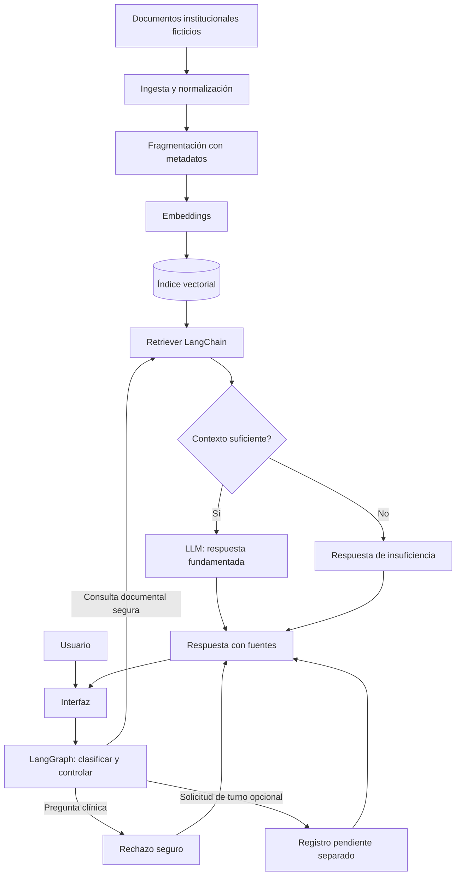

# Proceso general del proyecto

## Propósito

Diseñar **Medinova AI Agent**, un asistente administrativo para la clínica ficticia **Medinova**, que demuestre, ante todo, un pipeline RAG con LangChain, un flujo controlado con LangGraph y un despliegue reproducible en OCI. El agente responderá consultas institucionales con fuentes y rechazará diagnóstico o tratamiento médico. La solicitud de turnos será un carril secundario y desacoplado.

## Actores

- Paciente o visitante: consulta información y, si se aprueba el alcance, registra una solicitud de turno.
- Personal administrativo: consulta políticas y eventualmente revisa solicitudes.
- Equipo del proyecto: prepara documentos, evalúa el RAG y opera el despliegue.
- Proveedor de IA: genera embeddings y respuestas mediante una abstracción intercambiable.

## Flujo de punta a punta

Lectura alternativa: los documentos se indexan antes de las consultas. En tiempo de consulta, LangGraph decide la ruta; solo las consultas documentales permitidas ingresan al recuperador y al LLM.

## Entradas y salidas

| Entrada | Procesamiento | Salida |
|---|---|---|
| PDF institucional ficticio | carga, limpieza, chunks, embeddings | índice consultable con metadatos |
| Pregunta administrativa | seguridad, recuperación, generación | respuesta con documentos fuente |
| Pregunta clínica | control determinístico/clasificador | rechazo seguro y derivación profesional |
| Solicitud de turno | validación de campos y persistencia CSV | acuse de solicitud pendiente |

## Etapas y entregables

1. Planificación: documentos `docs/`, diagramas, decisiones y riesgos.
2. Definición de contenido: clínica ficticia y corpus de prueba.
3. Implementación RAG: ingesta, evaluación del retrieval y respuestas citadas.
4. Orquestación: grafo, rutas de seguridad y estado.
5. Interfaz y feature secundaria de turnos.
6. Pruebas, observabilidad y evidencia.
7. Despliegue en OCI y documentación final.

No se inicia ninguna etapa de implementación hasta resolver las decisiones bloqueantes registradas en `08_riesgos_y_decisiones.md`.
