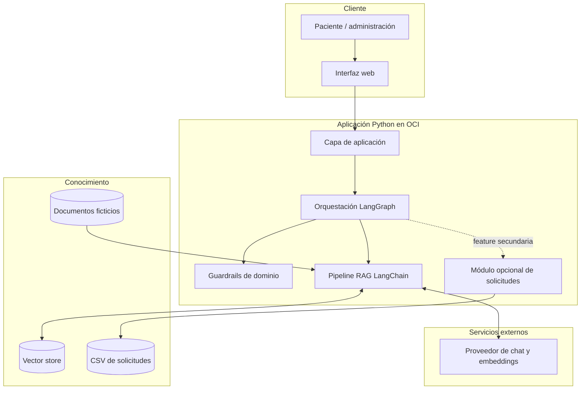

# Arquitectura propuesta

## Estado

Propuesta conceptual con nombre, audiencia, corpus PDF, Gemini y alcance de turnos confirmados. Streamlit queda recomendado a la espera de una última confirmación; vector store y modalidad OCI siguen abiertos.

## Principios

- RAG, LangChain, LangGraph y OCI deben ser visibles y evaluables.
- El LLM no decide por sí solo todos los controles de seguridad.
- Ingesta offline y consulta online se separan.
- Los proveedores de chat y embeddings se abstraen por configuración.
- Los turnos no comparten persistencia ni lógica con el índice documental.
- Solo se usan datos ficticios.

## Vista de contenedores



## Capas y responsabilidades

| Capa | Responsabilidad | No debe hacer |
|---|---|---|
| Presentación | capturar preguntas y mostrar fuentes/estados | contener lógica RAG |
| Aplicación | validar entrada y coordinar casos de uso | acoplarse a un proveedor |
| LangGraph | estado, rutas y terminación | almacenar documentos |
| Seguridad | detectar diagnóstico/tratamiento/síntomas y responder seguro | delegar todo al prompt generativo |
| LangChain/RAG | cargar, fragmentar, recuperar, construir prompt y citar | procesar turnos |
| Proveedores | instanciar chat y embeddings por configuración | filtrar reglas de negocio |
| Persistencia | índice documental y, aparte, solicitudes | mezclar PHI real; solo datos ficticios |

## Tecnologías candidatas

- Python, LangChain y LangGraph: requeridos por el objetivo técnico.
- Interfaz: **Streamlit** es la recomendación para el MVP porque toda la aplicación se mantiene en Python y permite chat, carga futura de PDF, formularios y panel multipágina sin un frontend separado. Flask queda como alternativa si después se requiere una API o mayor control web.
- Corpus: **PDF predefinido** como fuente confirmada. La interfaz reservará un control visible para agregar/reemplazar PDF en una evolución futura, pero la carga dinámica no forma parte del primer MVP hasta definir validación, reindexado y permisos.
- Vector store: FAISS/Chroma local para MVP o OCI Database 23ai para mayor integración OCI. Recomendación provisional: vector store local persistente para limitar costo y complejidad.
- Modelo: Gemini confirmado. Recomendación actual: `gemini-3.5-flash` estable para chat y `gemini-2.5-flash` como fallback configurable. El modelo de embeddings se decidirá y verificará por separado.
- Despliegue: OCI Compute con contenedor o proceso administrado; Container Instances es alternativa. La elección está pendiente.

## Estructura futura sugerida (no creada)

```text
app/
  graph.py              # estado, nodos y rutas LangGraph
  rag/                  # ingesta, retrieval, prompts y citas
  providers/            # factorías de chat y embeddings
  safety/               # reglas y clasificación de dominio
  appointments/         # solicitud pendiente y panel básico con CSV
  ui/                   # interfaz
source_documents/       # corpus ficticio versionado
data/                   # índices/solicitudes de demo no sensibles
tests/                  # unitarias, integración, RAG y grafo
docs/                   # decisiones y evidencia
```

## Límites de confianza

Las claves nunca se hardcodean ni se guardan en Git. En desarrollo local, `.env` permanece ignorado y solo `.env.example` documenta nombres sin valores. En OCI, la opción objetivo es guardar `GEMINI_API_KEY` en OCI Vault/Secret Management y permitir que la instancia la recupere mediante un instance principal, dynamic group y política IAM de mínimo privilegio. El secreto se mantiene solo en memoria o se inyecta al proceso; no se imprime en logs.

El proveedor externo recibe solo contenido ficticio. OCI expone únicamente el puerto de la aplicación; la administración se realiza por un canal seguro. Los logs no deben registrar preguntas, datos personales completos, cabeceras de autorización ni valores de configuración secretos.
