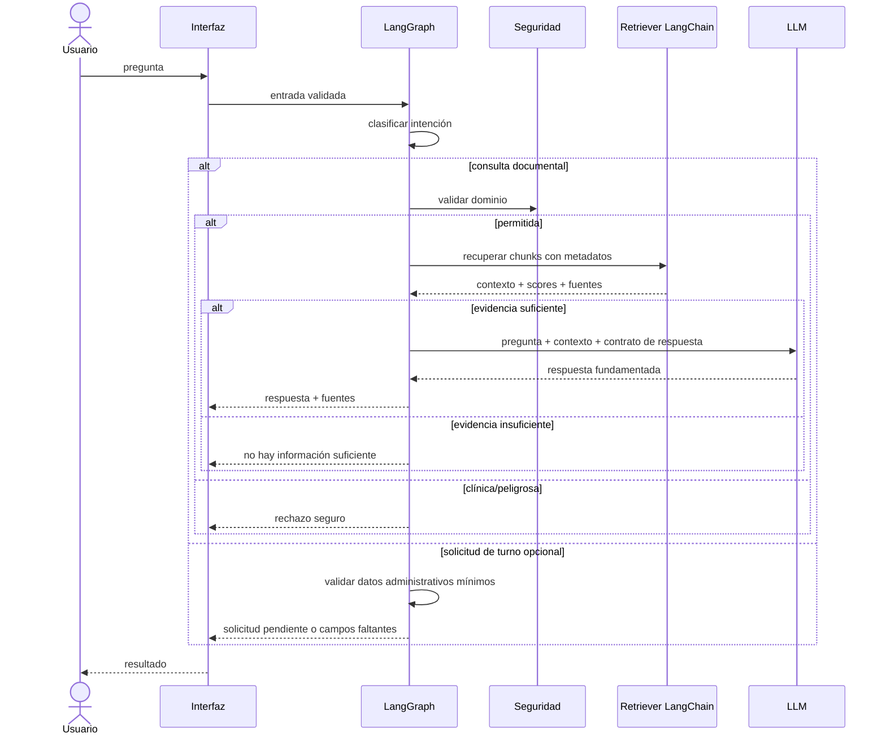

# Flujo del agente

## Objetivo

Controlar cada consulta mediante LangGraph antes de invocar el RAG. La salida debe ser trazable: intención, ruta, documentos recuperados y causa de rechazo o insuficiencia.

## Secuencia principal

## Estado conceptual

| Campo | Uso |
|---|---|
| `user_input` | texto original |
| `intent` | documental, clínica, turno, inválida |
| `safety_status` | permitida, rechazada, revisar |
| `retrieved_docs` | chunks y metadatos |
| `retrieval_evidence` | scores y reglas de suficiencia |
| `answer` | respuesta final |
| `citations` | documento, sección/página y chunk |
| `appointment_payload` | solo para la ruta secundaria |
| `errors` | fallos controlados y trazables |

## Contrato de respuesta RAG

- Usar exclusivamente el contexto recuperado.
- Distinguir respuesta total, parcial e insuficiente.
- Citar documento y localizador legible.
- No revelar prompts, claves o metadatos internos sensibles.
- No diagnosticar, recomendar medicamentos ni interpretar síntomas.
- Ante riesgo clínico, recomendar consulta profesional; la redacción de urgencia exacta queda pendiente de definición.

## Reducción de alucinaciones

Se combinarán filtros de dominio, retrieval con metadatos, umbral de suficiencia, prompt estricto, citas verificables y pruebas de groundedness. Un score vectorial aislado no se tratará como certeza: el criterio final debe validarse empíricamente con el corpus y el set de evaluación.
