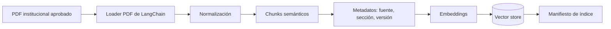
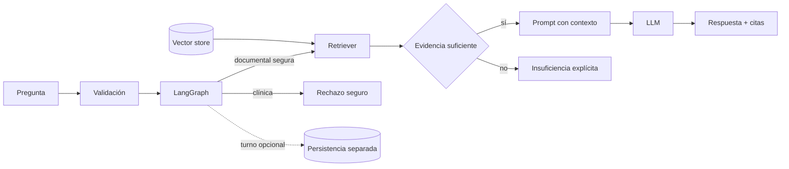

# Flujo de datos

## Dos tiempos del sistema

### Ingesta

### Consulta

## Metadatos mínimos por chunk

`source_id`, nombre de archivo, tipo, título/sección, página cuando exista, versión/fecha, hash del documento, índice del chunk y clasificación de acceso. Esto permite citas, reindexación idempotente y depuración.

## Transformaciones

- PDF: extraer por página y detectar extracción vacía; OCR queda fuera salvo aprobación.
- CSV: se usa únicamente para solicitudes de turnos; no se incorpora al índice RAG.
- Limpieza: normalizar espacios sin borrar encabezados, listas, fechas ni negaciones.
- Chunking: comenzar con separador recursivo sensible a secciones; tamaño y solapamiento se calibran con evaluación, no se fijan aún.

## Persistencia y ciclo de vida

El índice debe poder reconstruirse desde PDF versionados. Los cambios de documento, splitter o embeddings invalidan/reversionan el índice. Las solicitudes de turno viven en un CSV separado y nunca se incorporan al RAG. La futura carga de archivos deberá disparar validación, versionado y reindexación explícitos.

## Privacidad

Solo habrá documentos y datos ficticios. Se minimizarán campos en turnos, no se almacenará motivo clínico libre salvo decisión explícita y los logs usarán identificadores de correlación en vez de contenido completo.
