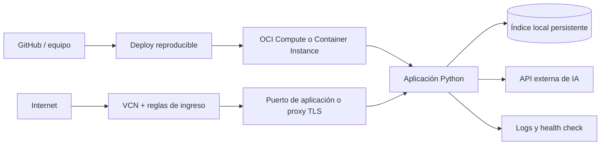

# Plan de despliegue en OCI

## Estado y objetivo

Plan conceptual y ruta de aprendizaje. El usuario todavía no conoce OCI, por lo que la modalidad no se fijará hasta completar una práctica guiada. El objetivo será mostrar una aplicación pública, reiniciable y observable sin convertir infraestructura avanzada en el centro del challenge.

## Alternativas

| Alternativa | Ventaja | Costo/riesgo | Encaje |
|---|---|---|---|
| Compute VM | visible, flexible y fácil de explicar | parches, firewall y proceso | recomendación provisional para aprendizaje |
| Container Instances | despliegue de contenedor más limpio | disponibilidad/costo y setup | buena si ya se usa Docker |
| OKE | demuestra Kubernetes | sobreingeniería y costo | fuera del MVP |

## Arquitectura provisional

## Requisitos

- Cuenta y compartimento OCI, VCN/subred, IP pública y reglas mínimas.
- Instancia compatible con dependencias; forma exacta pendiente.
- Ubuntu LTS o Oracle Linux, pendiente de confirmación.
- Variables de entorno gestionadas fuera de Git.
- OCI Vault/Secret Management para la clave de Gemini en el despliegue.
- Dynamic group, instance principal y política IAM limitada a leer ese secreto.
- Salida HTTPS hacia el proveedor de IA.
- Puerto externo: preferentemente 443 mediante proxy; el puerto interno depende de la interfaz.

## Procedimiento previsto

1. Aprovisionar red e instancia según decisión.
2. Aplicar actualizaciones y usuario sin privilegios.
3. Obtener una versión identificable del repositorio.
4. Instalar runtime o ejecutar contenedor.
5. Inyectar variables de entorno de forma segura.
6. Construir/cargar el índice desde el corpus ficticio.
7. Iniciar mediante servicio con reinicio automático.
8. Configurar ingreso mínimo y, si se aprueba, TLS/proxy.
9. Verificar health check, consulta RAG, cita, rechazo clínico y reinicio.

## Gestión de secretos

| Entorno | Mecanismo | Regla |
|---|---|---|
| Desarrollo local | archivo `.env` ignorado | solo en la computadora del desarrollador; nunca se comparte |
| Repositorio | `.env.example` | nombres y valores ficticios, jamás credenciales |
| OCI | Vault/Secret Management | secreto cifrado, versionable y recuperado durante la ejecución |

La instancia se autenticará frente a OCI mediante un **instance principal** incluido en un **dynamic group**. Una política IAM otorgará únicamente permiso de lectura sobre el secreto requerido. De esta manera no se copia una credencial OCI adicional dentro de la VM. La aplicación recibirá el secreto al iniciar o bajo demanda y nunca lo persistirá en CSV, logs, capturas ni respuestas de error.

Rotar la clave implicará crear una nueva versión del secreto y reiniciar/recargar la aplicación de forma controlada. Si una clave se expone, debe revocarse en Google AI Studio y reemplazarse en Vault.

## Ruta de aprendizaje previa

1. Reconocer región, compartimento, VCN, subred, instancia e IP pública.
2. Crear una instancia de práctica y conectarse por SSH.
3. Comprender reglas de ingreso y diferencia entre puerto interno y público.
4. Aprender Vault, dynamic groups, instance principals y políticas IAM mínimas.
5. Ejecutar una aplicación Python mínima y detenerla de forma segura.
6. Recién entonces elegir Compute o Container Instances para Medinova.

Esta práctica será una etapa guiada futura; no bloquea la planificación del RAG.

## Verificación y evidencia

- URL pública o captura con IP/host visible.
- Consola OCI con instancia activa y forma utilizada.
- Respuesta documental con fuente.
- Rechazo seguro de pregunta clínica.
- Grafo/trace o logs sanitizados que muestren la ruta.
- Comando/servicio de ejecución y prueba de reinicio.
- Fecha, commit desplegado y variables requeridas (sin valores secretos).

## Operación mínima

Definir health endpoint, rotación de logs, límites de tamaño, timeout del proveedor y comportamiento ante API caída. No registrar claves ni texto completo de solicitudes. Presupuesto, región, forma y estrategia TLS son decisiones abiertas.
