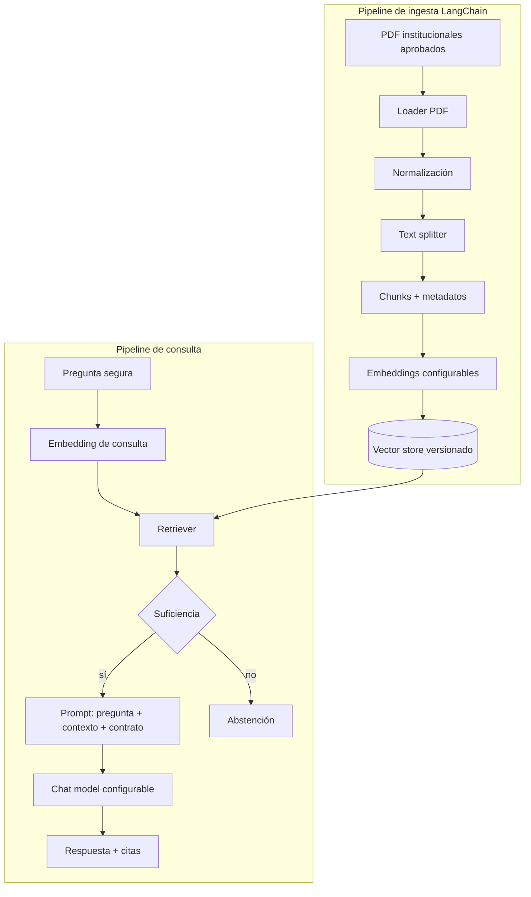
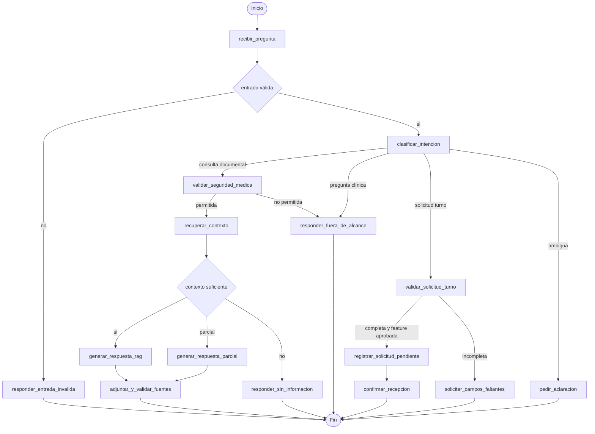

# Diseño RAG con LangChain y LangGraph

## Objetivo técnico

El corazón del proyecto es un RAG evaluable: LangChain implementa el ciclo documental y LangGraph gobierna intención, seguridad, recuperación, suficiencia y terminación. Turnos es una rama separada que nunca contamina el contexto RAG.

## Arquitectura RAG

LangChain será responsable de loaders, splitters, embeddings, vector store/retriever, plantillas y composición de la cadena. La interfaz se conectará al grafo, no directamente a la chain.

## Grafo propuesto

## Nodos y contratos

| Nodo | Entrada | Salida/efecto |
|---|---|---|
| `recibir_pregunta` | payload UI | texto normalizado, id de traza |
| `clasificar_intencion` | texto | intención + confianza/razón |
| `validar_seguridad_medica` | texto/intención | permitida, rechazada o conservadora |
| `recuperar_contexto` | pregunta | chunks, fuentes y scores |
| `evaluar_suficiencia` | chunks | total, parcial o insuficiente |
| `generar_respuesta_rag` | pregunta/contexto | respuesta restringida |
| `adjuntar_y_validar_fuentes` | respuesta/chunks | citas existentes y deduplicadas |
| `responder_fuera_de_alcance` | pregunta | mensaje seguro sin consejo clínico |
| `validar_solicitud_turno` | payload | datos válidos o faltantes |
| `registrar_solicitud_pendiente` | payload válido | identificador, solo si se aprueba |

## Condiciones de ruteo

- Pregunta clínica explícita va directamente al rechazo y no recupera contexto.
- Una consulta administrativa sobre turnos sigue RAG; una petición de registrar turno sigue la rama secundaria.
- La intención ambigua no activa escrituras.
- Un fallo del retriever no se interpreta como corpus insuficiente: devuelve error controlado.
- La generación solo ocurre con evidencia suficiente o parcial identificada.
- Las citas solo pueden referir chunks presentes en el estado de esa ejecución.

## Seguridad médica en capas

1. Reglas de alta cobertura para diagnóstico, síntomas, dosis, medicamentos y tratamiento.
2. Clasificador de intención con salida estructurada para lenguaje menos explícito.
3. Política conservadora ante baja confianza.
4. Prompt generativo limitado a contexto institucional.
5. Pruebas adversariales y trazabilidad de la ruta.

El texto de rechazo no debe simular consejo de emergencia específico sin una política aprobada. Sí debe aclarar que el sistema no sustituye a profesionales y orientar al contacto apropiado.

## Suficiencia y citas

La suficiencia combinará score/ranking, presencia de términos/entidades esperadas y validación del contexto. No se fija aún un umbral universal. Cada cita incluirá como mínimo archivo y sección o página; opcionalmente versión y fragmento breve.

## Separación de turnos

La rama de turnos usa un payload propio, autorización explícita de escritura y un CSV separado. No usa el LLM para confirmar disponibilidad ni convierte una solicitud en turno confirmado. Su estado inicial será `pendiente`. El panel será de lectura y filtrado básico; la concurrencia del CSV deberá probarse.

## Observabilidad y evaluación

Registrar de forma sanitizada: id de traza, ruta, latencias por nodo, ids de chunks, proveedor/modelo, resultado de suficiencia y errores. Evaluar retrieval antes de generación, groundedness después y recall de seguridad por separado.

## Decisiones pendientes

- Los modelos quedaron confirmados: `gemini-3.5-flash`, fallback `gemini-2.5-flash` y `gemini-embedding-001`.
- Vector store y estrategia de indexado.
- Chunking inicial y momento en que se habilitará la carga dinámica de PDF.
- Clasificador de intención: mismo LLM, modelo pequeño o reglas híbridas.
- Métricas/umbrales de suficiencia y objetivos de evaluación.
- Modalidad OCI y momento de habilitar carga dinámica de PDF. Streamlit y Chroma local ya quedaron confirmados.

Todas están registradas como ADR abiertas en `08_riesgos_y_decisiones.md`.
